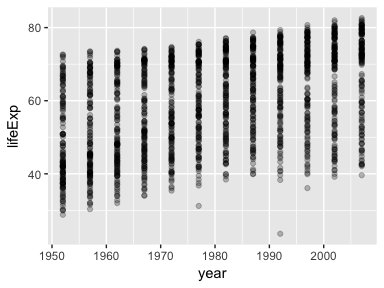
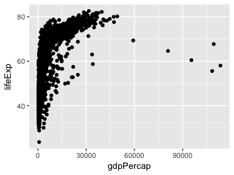
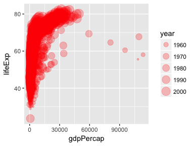
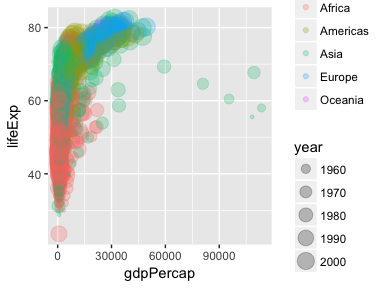

# cm006 Notes and Exercises: Intro to ggplot2
2017-09-21  


```r
suppressPackageStartupMessages(library(tidyverse))  # The tidyverse contains ggplot2!
suppressPackageStartupMessages(library(gapminder))
knitr::opts_chunk$set(fig.width=4, fig.height=3)
```


## Plotting in R

There are three main ways you can produce graphics in R. In order of inception, they are

- base R
- `lattice` (an R package)
- `ggplot2` (an R package)

Base R is tedious and unwieldly. Lattice is a nice option, but I find it requires setting up a plot to then just override everything.

`ggplot2` is a very powerful plotting system that...

- creates graphics by adding layers.
- is based off of the [grammar of graphics](http://www.springer.com/gp/book/9780387245447) (book by Leland Wilkinson) -- hence "gg".
- comes with the `tidyverse` meta-package.
- has a steep learning curve, but pays dividends.

Stackoverflow was my main source of learning. Google what you're trying to do, and persevere. You can do it.


## `ggplot2` framework

First, there are two ways you can make a plot wth `ggplot2`.

1. The `qplot` function: limited functionality. "quick plot"
    - We won't be focussing on this. No training wheels!
2. The `ggplot` function: full functionality.

Let's go through the basic syntax using the `gapminder` dataset.


#### 1. Basic scatterplot

Let's try to make a basic scatterplot of `year` vs. `lifeExp`. 

Quick ways:
    - `plot(gapminder$year, gapminder$lifeExp)` -- base R
    - `qplot(year, lifeExp, data=gapminder)` -- `ggplot2`'s "quick plot".

Let's just see the syntax right off the bat.


```r
ggplot(gapminder, aes(x=year, y=lifeExp)) +
    geom_point()
```

<!-- -->
Can add size = another variable.
aes = link the x and y
ggplot(gapminder, aes(x=year, y=lifeExp)) - just set up the plot with scales but without the points.


The first line initiates the plot. The second one _adds a layer_ of points. 

Let's see the components of each of these. 

Two of the most important aspects of a ggplot are the __geometric objects__ and the __scales__ (part of the grammar of graphics). 

- __geometric objects__ are things that you can draw to represent data.
    - Examples: points, lines, polygons, bars, boxplots, histograms
    - Indicated as new layers with `geom_*` where `*` is `point`, `line`, ...
- __scales__ are aspects of a geometric object that correspond to a numeric scale.
    - Examples:
        - horizontal (x) position can indicate one variable.
        - vertical (y) position can indicate another variable.
        - size of a point
        - shape of a point
        - transparency
    - __aesthetic mappings__ link variables to scales through the function `aes`.

Every geometric object has _required_ and _optional_ aesthetic mappings. Check the documentation of the `geom_` to see what's required (in bold). Examples:
    - _points_ require a horizontal (x) and vertical (y) position.
    - line _segments_ require starting and ending x and y
    
    
?geom_point
Asthetic 
- alpha = alpha transparency scale (the transparency of the points)


Let's revisit the above plot. The first line outputs an empty plot because there are no `geom`'s (geometric objects):


```r
p <- ggplot(gapminder, aes(x=year, y=lifeExp))
p
```

<!-- -->

(Yes, we can assign ggplots to variables in R)

Contains:
    1. the data frame, `gapminder`, and
    2. an indication of which variables in the data frame go with which scale.


```r
p <- ggplot(gapminder, aes(x=year, y=lifeExp))
p + geom_point()
```

<!-- -->

Next, we can add a _layer_ with the `+` symbol. We add the "point" geometry to "execute" the setup and display points, to obtain the original plot.

This plot would benefit with some _alpha transparency_ -- another type of scale. Let's put in 25% transparency:


```r
p + geom_point(alpha=0.25)
```

<!-- -->
alpha - to avoid overploting, every point has 25% transparency but when they are layering the overlapping parts become darker.

The unit of the plot - character expansion (between 1 and 10)


Notes:
    - This scale is _outside of an aesthetic mapping_, meaning that ggplot will not associate it with a variable.
    - Scales can be indicated in the `geom` call. Scales within `aes` that appear in the `ggplot` function apply "globally" to the plot. 
    

```r
p + geom_point(aes(alpha=0.25))
```

<!-- -->
Now you are assigning a vairable 0.25, so it will appear in every plot
Can put the aes in ggplot (over all plot), if put into geom_point, it will be in the layer of points only.

```r
ggplot(gapminder) + 
  geom_point(aes(x=year, y =lifeExp))
```

<!-- -->


__Exercises__:

1. Make a scatterplot of `gdpPercap` vs `lifeExp`. Store it in a variable called `p2`.

```r
p2 <- ggplot(gapminder, aes(x=gdpPercap, y=lifeExp))
p2 + geom_point()
```

<!-- -->


2. To `p2`, make the size of the points indicate the `year`, choose a level of alpha transparency that you're happy with, and make the points your favourite colour.

```r
p2 + geom_point(aes(size = year), color="red", alpha=0.25)
```

<!-- -->
Have to add color = "red" outside the aes bracket so that ggplot will not recognize it as a variable.


3. To `p2`, colour the points by `continent`. but this time with year being represented by the size of the points.

```r
p2 + geom_point(aes(colour = continent, size=year), alpha=0.25)
```

<!-- -->


4. To `p2`, add another layer called `scale_x_log10()`. Make a second plot by redoing the plot in (1), but replacing `gdpPercap` with `log10(gdpPercap)`. What do you notice?


```r
p2 + geom_point(aes(colour = continent, size=year), alpha=0.25) + scale_x_log10()
```

<!-- -->
scale_x_log10() is a handy function to make log10 graph.


## Continuation of `ggplot2`

Now that we've got the basics down pat, let's expand our flexibility by going through [Jenny's scatterplot tutorial](https://github.com/jennybc/ggplot2-tutorial/blob/master/gapminder-ggplot2-scatterplot.md).

### Regression curve

__Exercise 5__: Make a plot of `year` (x) vs `lifeExp` (y), with points coloured by continent. Then, fit a regression line to each continent, without the error bars. If you can, try piping the data frame into the `ggplot` function.

### Facetting

__Exercise 6__: Make a plot of `year` (x) vs `lifeExp` (y), facetted by continent. Then, fit a smoother through the data for each continent, without the error bars. Choose a span that you feel is appropriate.

### `geom_line`

The key here is to remember to indicate the variable to group by with `group=variable`.

__Exercise 7__: Plot the population over time (year) using lines, so that each country has its own line. Add alpha transparency to your liking. 

__Exercise 8__: Add points to the plot in Exercise 7.
